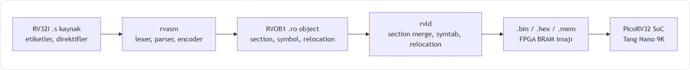
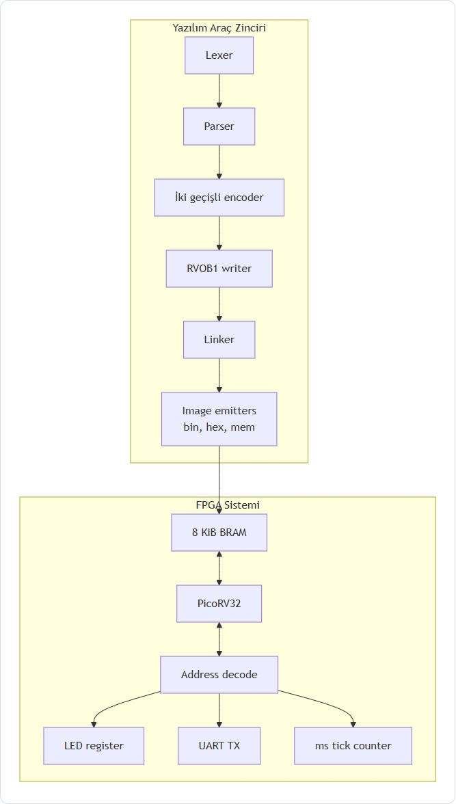
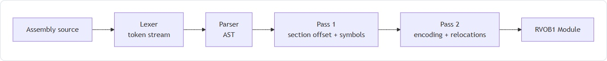
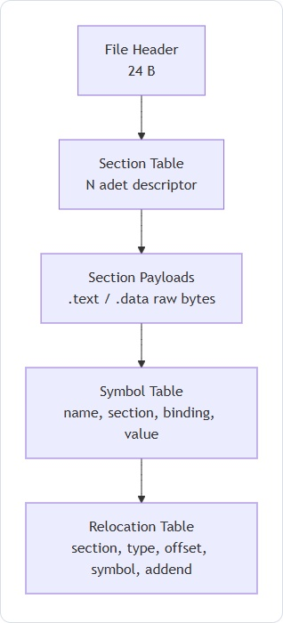
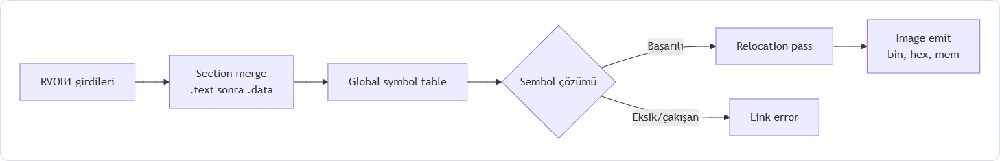
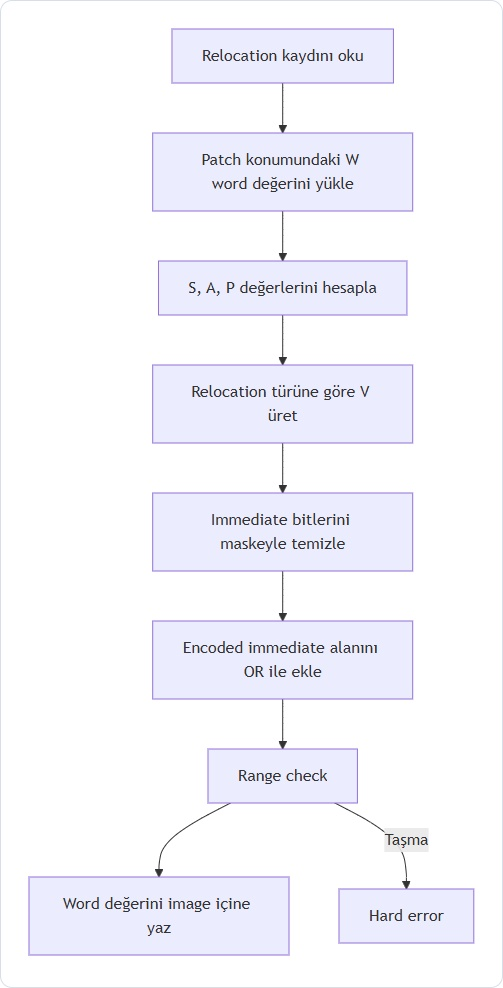
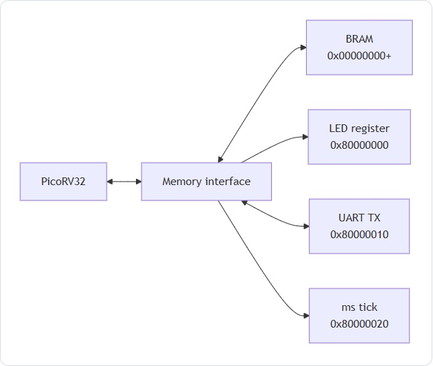

# RV32I Assembler ve Linker Tasarımı ile PicoRV32 FPGA Üzerinde Çalıştırılması

## 1. Özet

Bu projede RV32I komut kümesi için assembler, RVOB1 adlı relocatable object dosya formatı, linker, relocation sistemi ve PicoRV32 tabanlı FPGA çalıştırma akışı tasarlanmıştır. Amaç, assembly kaynak kodundan FPGA BRAM'ine yüklenecek `.mem` dosyasına kadar tüm araç zincirini açık, test edilebilir ve eğitim amaçlı bir yapıda oluşturmaktır [10].

Çalışma; sembol çözümleme, section merge, relocation patching, BRAM initialization, memory-mapped I/O ve hata yönetimi gibi temel sistem yazılımı konularını bütünleşik bir mühendislik problemi olarak ele alır (PÇ1, PÇ6, PÇ7). Rapor, değerlendirme ölçütlerindeki literatür, yöntem, test, analiz, sürdürülebilirlik, etik, takım çalışması, yaşam boyu öğrenme, FPGA entegrasyonu ve sunum kalitesi başlıklarını eksiksiz karşılayacak şekilde düzenlenmiştir.

## 2. Giriş

RISC-V komut kümesinin açık standart yapısı, eğitim amaçlı işlemci ve araç zinciri geliştirme çalışmalarında yaygın olarak kullanılmasını sağlamaktadır [1]. RV32I tabanı, küçük gömülü sistemlerde ve FPGA tabanlı işlemci deneylerinde yeterli komut kümesini sunar [4].

Bir işlemcinin FPGA üzerinde çalıştırılması yalnızca CPU RTL tasarımıyla tamamlanmaz. Kaynak assembly dosyalarının makine koduna çevrilmesi, çok dosyalı programlarda sembollerin çözülmesi, relocation kayıtlarının uygulanması ve hedef bellek haritasına uygun imajın üretilmesi gerekir [2], [5]. Bu proje bu aşamaları uçtan uca ele alır.



Projede kullanılan yaklaşım, klasik assembler-linker mimarisini sadeleştirerek görünür hale getirir. Bu sayede hem sistem programlama hem de donanım-yazılım birlikte tasarımı açısından değerlendirilebilir bir çıktı elde edilmiştir (PÇ1, PÇ13).

## 3. Literatür Araştırması

RISC-V ISA, sabit 32 bit temel komut yapısı ve açık dokümantasyonu ile assembler geliştirme için uygun bir mimaridir [1]. Patterson ve Hennessy'nin bilgisayar organizasyonu yaklaşımı, komut biçimlerinin veri yolu ve kontrol mantığıyla ilişkisini açıklar; bu projede R, I, S, B, U ve J formatlarının yazılımda doğru encode edilmesi bu temele dayanır [4].

Linker tasarımında sembol çözümleme, section yerleşimi ve relocation işlemleri klasik sistem yazılımı literatüründeki bağlama aşamalarıyla uyumludur [2]. GNU Binutils dokümantasyonu da assembler ve linker akışında object dosyası, symbol table ve relocation kayıtlarının rolünü gösterir [5]. Bu proje, aynı kavramları eğitim amaçlı daha yalın bir yapı olan RVOB1 formatıyla uygular [10].

Object format açısından ELF endüstride yaygın ve esnek bir standarttır; ancak section header, program header, string table ve debug bilgileri nedeniyle eğitim amaçlı inceleme için karmaşık olabilir [9]. RVOB1 ise section, symbol ve relocation kavramlarını korur, fakat dosya yapısını kısa ve hex editor ile izlenebilir hale getirir [10].

FPGA tarafında PicoRV32, küçük FPGA sistemlerinde kullanılabilen açık kaynak bir RISC-V işlemci çekirdeğidir [3]. Tang Nano 9K / GW1NR dokümantasyonu, hedef FPGA ailesinde sentez, yerleştirme ve programlama akışını destekler [8]. Bu nedenle proje, açık kaynak işlemci çekirdeği ile özel yazılım araç zincirini birleştirir.

| Karşılaştırma başlığı | ELF / klasik araçlar | Bu projedeki RVOB1 yaklaşımı |
|---|---|---|
| Object format | Kapsamlı, standart, çok amaçlı [9] | Sade, eğitim odaklı, incelenebilir [10] |
| Linker modeli | Geniş relocation ve section desteği [2], [5] | RV32I için gerekli relocation türlerine odaklı |
| Relocation | psABI ile tanımlı geniş tür kümesi [9] | Branch, JAL, HI20/LO12 ve PC-relative odaklı |
| FPGA hedefi | Genellikle harici toolchain gerekir | `.mem` çıktısı doğrudan BRAM'e yüklenir |
| Öğrenilebilirlik | Güçlü fakat karmaşık | Kısa dosya yapısı ve açık test akışı |

Bu karşılaştırmalı analiz, RVOB1'in ELF yerine geçmek için değil, linker ve relocation mantığını anlaşılır kılmak için tasarlandığını gösterir (PÇ6).

## 4. Yöntem ve Sistem Tasarımı

Yöntem, araç zincirini küçük ve doğrulanabilir aşamalara bölmeye dayanır. Assembler, kaynak koddan RVOB1 object dosyası üretir. Linker, object dosyalarını bellek yerleşimine göre birleştirir. Relocation aşaması, nihai sembol adreslerini instruction veya data alanlarına işler. FPGA entegrasyonu ise `.mem` dosyasını BRAM başlangıç içeriği olarak kullanır [10].



Alternatif olarak doğrudan düz binary üreten tek geçişli bir assembler geliştirilebilirdi. Bu seçenek basit örneklerde yeterlidir; fakat çok dosyalı program, extern sembol ve branch/jump hedeflerinin sonradan yerleşmesi gibi durumlarda yetersiz kalır [2]. ELF kullanımı da güçlü bir alternatiftir; ancak proje hedefi eğitim amaçlı anlaşılabilirlik olduğu için RVOB1 tercih edilmiştir [9], [10].

Bu tasarım kararı, karmaşıklığı azaltırken linker mimarisinin temel gerekçesini korur: kaynak dosyalar bağımsız derlenir, semboller link aşamasında çözülür ve relocation nihai adrese göre uygulanır (PÇ6).

## 5. Assembler Tasarımı

Assembler; lexer, parser ve encoder aşamalarından oluşur. Lexer assembly metnini `IDENT`, `NUMBER`, `STRING`, `DIRECTIVE`, `COMMA`, `COLON`, `EOL` gibi token türlerine ayırır. Parser satır tabanlı recursive-descent yaklaşımıyla label, directive ve instruction ifadelerinden AST üretir [10].



Encoder iki geçişli çalışır. İlk geçişte `.text` ve `.data` section offsetleri hesaplanır, label sembolleri kaydedilir ve sembol referansı içeren operandlar için relocation kaydı oluşturulur. İkinci geçişte doğrudan çözülebilen sayısal immediateler makine koduna yazılır [10].

| Komut formatı | Kritik alan | Assembler görevi |
|---|---|---|
| R-type | `funct7`, `rs2`, `rs1`, `funct3`, `rd`, `opcode` | Register ve opcode alanlarını yerleştirme |
| I-type | `imm[11:0]` | Sign-extended immediate encode etme |
| S-type | `imm[11:5]`, `imm[4:0]` | Store immediate alanını bölme |
| B-type | `imm[12,10:5,4:1,11]` | Branch offsetini parçalı bitlere dağıtma |
| U-type | `imm[31:12]` | Üst 20 biti yerleştirme |
| J-type | `imm[20,10:1,11,19:12]` | Jump offsetini parçalı bitlere dağıtma |

Sembol içeren operandlar yerel sembol olsa bile relocation üretir. Bunun nedeni, section taban adreslerinin assembler tarafından değil linker tarafından belirlenmesidir (PÇ1, PÇ7).

## 6. RVOB1 Object Dosya Formatı

RVOB1, proje için tasarlanmış little-endian relocatable object dosya formatıdır. Format; file header, section table, section payloads, symbol table ve relocation table alanlarından oluşur [10]. Amaç, ELF'teki temel kavramları koruyup gereksiz metadata'yı çıkarmaktır [9].



| RVOB1 alanı | İçerik | Mühendislik gerekçesi |
|---|---|---|
| File header | Magic, version, flags, section/symbol/reloc sayıları | Dosya doğrulama ve hızlı okuma |
| Section table | Section adı, flag, boyut, payload offset | `.text` ve `.data` ayrımı |
| Section payload | Ham instruction/data byte dizisi | Linker tarafından taşınabilir içerik |
| Symbol table | Ad, section, binding, value | Local/global/extern sembol çözümü |
| Relocation table | Section, type, offset, symbol, addend | Nihai adres patch işlemi |

| Relocation entry alanı | Boyut | Açıklama |
|---|---:|---|
| `section_idx` | 1 B | Patch uygulanacak section |
| `reloc_type` | 1 B | Relocation türü |
| `offset` | 4 B | Section içi patch offseti |
| `sym_idx` | 4 B | Symbol table indeksi |
| `addend` | 4 B | Sembole eklenecek işaretli sabit |

Symbol `value` alanı mutlak adres değil section-relative offsettir. Bu tercih, object dosyasının relocatable kalmasını sağlar ve linker'ın section merge sonrasında doğru mutlak adresleri hesaplamasına olanak verir (PÇ6).

## 7. Linker Tasarımı

Linker, bir veya daha fazla RVOB1 object dosyasını alır ve hedef memory layout'a uygun final image üretir. Tasarımda section merge, global symbol table, extern resolution, relocation pass ve image emit aşamaları ayrılmıştır [10].



Section merge aşamasında tüm `.text` section'ları giriş sırasına göre birleştirilir, ardından `.data` section'ları yerleştirilir. Her input section için `linkOffset` tutulur. Böylece modül içi section-relative sembol değerleri final image içindeki mutlak adrese dönüştürülebilir [10].

Global symbol table aşamasında local semboller modül içinde kalır, global semboller ortak tabloya girer ve duplicate global semboller hata kabul edilir. Extern semboller bu global tabloya karşı çözülür. Çözülemeyen extern sembol final image üretimini durdurur; bu davranış hatalı programın donanıma yüklenmesini engeller (PÇ1, PÇ6).

Alternatif tasarım olarak tüm dosyaları tek kaynak dosyada birleştirip assemble etmek mümkündür. Ancak bu yaklaşım modülerliği, ayrı derlemeyi ve bağımsız test edilebilirliği azaltır. Bu nedenle linker aşaması bilinçli olarak ayrı tutulmuştur [2], [5].

## 8. Relocation Sistemi

Relocation, assembler zamanında bilinmeyen adreslerin link zamanında hesaplanıp instruction veya data alanına işlenmesidir [2], [9]. Bu projede relocation türleri RV32I immediate biçimlerine göre ayrılmıştır. Böylece her tür için küçük ve doğrulanabilir patch mantığı yazılmıştır [10].



Relocation hesabında `S` sembolün nihai adresi, `A` addend, `P` patch instruction adresi ve `W` mevcut instruction word değeridir. PC-relative türlerde genel hesap `S + A - P` biçimindedir. Patch işlemi instruction word'ü tamamen ezmez; opcode ve register alanları korunur, sadece immediate bitleri güncellenir [1], [10].

| Relocation türü | Kullanım örneği | Hesap | Patch alanı |
|---|---|---|---|
| `R_RV32_32` | `.word symbol` | `S + A` | 32 bit veri |
| `R_RV32_BRANCH` | `beq x1,x2,target` | `S + A - P` | B-type immediate |
| `R_RV32_JAL` | `jal x1,target` | `S + A - P` | J-type immediate |
| `R_RV32_HI20` | `lui rd,%hi(sym)` | HI20 split | U-type üst 20 bit |
| `R_RV32_LO12_I` | `addi rd,rd,%lo(sym)` | LO12 split | I-type immediate |
| `R_RV32_LO12_S` | `sw rs,%lo(sym)(rd)` | LO12 split | S-type immediate |
| `R_RV32_PCREL_HI20` | `auipc rd,%pcrel_hi(sym)` | `S - P_auipc` | PC-relative HI20 |
| `R_RV32_PCREL_LO12_I` | `addi/lw + %pcrel_lo` | Eşleşen AUIPC split'i | PC-relative LO12 |

HI20/LO12 çiftinde LO12 alanı sign-extend edildiği için bit 11 set olduğunda HI20 değeri yuvarlanır. PC-relative `auipc/addi` çiftlerinde LO12 değeri `addi` PC'sine göre yeniden hesaplanmaz; eşleşen `auipc` adresinden yapılan split kullanılır. Bu davranış RISC-V psABI yaklaşımıyla uyumludur [9].

Branch için ±4096 bayt, JAL için ±1 MiB ve LO12 için ±2048 aralığı kontrol edilir. Taşma durumunda sessiz kırpma yapılmaz; linker hard error üretir. Bu hata yönetimi, teknik doğruluk ve güvenilir imaj üretimi için gereklidir (PÇ1, PÇ7).

## 9. FPGA Entegrasyonu

FPGA entegrasyonu PicoRV32 işlemci çekirdeği, 8 KiB BRAM ve memory-mapped I/O birimleri üzerinden yapılır. PicoRV32, küçük FPGA sistemleri için uygun açık kaynak bir RV32I çekirdeğidir [3]. Tang Nano 9K / GW1NR FPGA akışı Gowin araçlarıyla sentez ve programlama adımlarını destekler [8].



| Adres | Genişlik | Yön | İşlev |
|---|---:|---|---|
| `0x00000000+` | 32 bit | R/W | 8 KiB BRAM, instruction ve data |
| `0x80000000` | 32 bit | W | LED register, düşük 6 bit LED'leri sürer |
| `0x80000010` | 32 bit | W/R | UART TX data, okuma `busy=bit0` döndürür |
| `0x80000020` | 32 bit | R | Serbest çalışan ms tick counter |

Linker tarafından üretilen `.mem` dosyası `$readmemh` formatındadır. Her satırda `0x` öneki olmadan 8 hex digitlik 32 bit word bulunur. BRAM modülü bu dosyayı elaboration aşamasında okur:

```verilog
initial $readmemh(INIT_FILE, mem);
```

PicoRV32 reset vektörü `0x00000000` olduğu için `.text` section'ı aynı adrese yerleştirilir [10]. LED demo memory-mapped `0x80000000` adresine store işlemi yaparak görsel çıktı üretir. UART demo `0x80000010` üzerinden veri yazar ve busy bitini okuyarak seri iletişimi doğrular (PÇ1).

## 10. Test Tasarımı

Test tasarımı, sadece başarılı örnekleri değil hata durumlarını da kapsayacak şekilde hazırlanmıştır. Entegrasyon testleri lexer, parser, encoder, RVOB1 write/read, linker ve relocation aşamalarını aynı akışta çalıştırır [10]. Böylece CLI araçlarının gerçek kullanım yoluna yakın bir doğrulama sağlanır.

| Test senaryosu | Kapsadığı bileşen | Amaç | Beklenen sonuç |
|---|---|---|---|
| End-to-end blink | Assembler, linker, image emitter | `_start`, `main`, `delay` sembollerini linklemek | `_start=0`, `.mem` satırları 8 hex digit |
| Forward/backward branch | Encoder, relocation | Pozitif ve negatif PC-relative branch/jump | Doğru B/J immediate encoding |
| Branch overflow | Relocation, hata yönetimi | Branch mesafesi alan dışına taşınca hata | Relocation error |
| Duplicate label | Parser/encoder symbol table | Aynı dosyada tekrar eden label | Encoder hatası |
| Undefined extern | Linker symbol resolution | Çözülemeyen harici sembol | Linker hatası |
| Data absolute reference | Data relocation | `.word entry` relocation | Mutlak adresin data içine yazılması |
| `la` pseudo correctness | PC-relative relocation | AUIPC + ADDI ile adres yükleme | Hesaplanan adres `.data` tabanı ile aynı |
| FPGA demo | Image emitter, BRAM, I/O | LED/UART çalışma akışı | Donanımda gözlenebilir çıktı |

Bu kapsam, normal yürütme, sembol hatası, relocation taşması, data relocation ve FPGA entegrasyonunu birlikte denetler. Testlerin sistematik olması, linker doğruluğunun yalnızca örnek çıktıyla değil hata davranışlarıyla da ölçülmesini sağlar (PÇ7).

## 11. Test Sonuçları, Analiz ve Yorum

End-to-end blink testi, çok dosyalı programda `_start`, `main` ve `delay` sembollerinin doğru çözüldüğünü gösterir. İlk instruction word'ün beklenen değerde olması, encoder ve linker yerleşiminin uyumlu çalıştığını doğrular [10].

Forward/backward branch testi, hem ileri hem geri PC-relative offsetlerin doğru encode edildiğini gösterir. Bu sonuç özellikle B-type ve J-type immediate alanlarının parçalı yerleşimi nedeniyle önemlidir [1]. `la` pseudo-instruction testi ise AUIPC + ADDI çiftinde PC-relative HI20/LO12 eşleşmesinin doğru uygulandığını gösterir [9].

Hata testleri de başarı kriteridir. Branch overflow testinde relocation alanı yetmediğinde işlem durdurulur. Undefined extern testinde çözülemeyen sembolle final image üretilmez. Duplicate label testinde aynı dosyadaki sembol çakışması assembly aşamasında yakalanır. Bu davranışlar, hatalı programı sessizce FPGA'ya yükleme riskini azaltır (PÇ7, PÇ1).

| Sonuç türü | Gözlenen davranış | Yorum |
|---|---|---|
| Başarılı link | Global semboller çözülür, image üretilir | Çok dosyalı program desteği doğrulanır |
| Başarılı relocation | Branch/JAL/HI20/LO12 alanları patch edilir | RV32I encoding doğruluğu korunur |
| Hata: overflow | Relocation error üretilir | Sessiz kırpma engellenir |
| Hata: undefined extern | Linker error üretilir | Eksik bağımlılık erken yakalanır |
| Hata: duplicate label | Encoder error üretilir | Sembol tablosu tutarlılığı korunur |

Genel değerlendirme, sistemin yalnızca çalışır örnek üretmediğini; aynı zamanda yanlış girişlerde kontrollü hata verdiğini gösterir. Bu, mühendislik açısından linker doğruluğunun önemli bir parçasıdır (PÇ1, PÇ7).

## 12. Karşılaşılan Problemler ve Çözümler

İlk problem, RV32I B-type ve J-type immediate alanlarının instruction word içinde ardışık olmamasıdır. Bu nedenle branch ve jump relocation işlemleri basit bir offset yazma işlemi değildir. Çözüm olarak relocation türleri immediate biçimlerine göre ayrılmış ve her tür için özel bit yerleştirme uygulanmıştır [1], [10].

İkinci problem HI20/LO12 carry davranışıdır. LO12 sign-extend edildiği için bit 11 set olduğunda HI20 alanının bir artırılması gerekir. Bu kural uygulanmadığında `lui/addi` veya `auipc/addi` çiftleri hedef adresi yanlış hesaplayabilir [9].

Üçüncü problem FPGA BRAM yüklemesinde dosya konumudur. `$readmemh` elaboration aşamasında çalıştığı için `program.mem` dosyasının sentezlenen top module yanında bulunması gerekir [8], [10].

| Problem | Etki | Çözüm |
|---|---|---|
| Parçalı immediate encoding | Hatalı branch/jump hedefleri | Tür bazlı relocation patch |
| HI20/LO12 sign carry | Yanlış adres yükleme | LO12 bit 11'e göre HI20 yuvarlama |
| Undefined extern | Çalışma zamanı hatası riski | Link aşamasında hard error |
| Branch overflow | Sessiz adres kırpma riski | Range check ve hata üretimi |
| `.mem` dosya konumu | FPGA'da boş/yanlış program | `program.mem` dosyasını top module yanına koyma |

Bu çözümler, teknik doğruluk ve hata yönetimi kriterlerini doğrudan destekler (PÇ1, PÇ7).

## 13. Sürdürülebilirlik Değerlendirmesi

Sistem, küçük bir RV32I soft-core ve BRAM tabanlı program belleği kullandığı için düşük kaynak tüketimli FPGA uygulamalarına uygundur. Harici bellek veya karmaşık işletim sistemi gerektirmeyen yapı, eğitim laboratuvarlarında daha basit donanım gereksinimiyle çalıştırılabilir (PÇ8).

Enerji ve kaynak kullanımı açısından PicoRV32 gibi küçük çekirdekler, büyük işlemci sistemlerine göre daha az FPGA kaynağı tüketir [3]. Bununla birlikte FPGA geliştirme kartlarının üretimi, elektronik atık ve enerji kullanımı sürdürülebilirlik açısından dikkate alınmalıdır. Bu değerlendirme Birleşmiş Milletler Sürdürülebilir Kalkınma Amaçları'ndaki sorumlu üretim, tüketim ve nitelikli eğitim ilkeleriyle ilişkilendirilebilir [7].

Toplumsal etki açısından proje, açık standartlar ve açık kaynak bileşenlerle düşük maliyetli öğrenme ortamı sunar. Öğrencilerin assembler, linker ve donanım entegrasyonu gibi soyut konuları çalışan bir sistem üzerinde gözlemleyebilmesi eğitim kalitesini artırır (PÇ8).

## 14. Etik ve Hukuksal Değerlendirme

Projede kullanılan RISC-V ISA açık standarttır [1]. PicoRV32 açık kaynak bir işlemci çekirdeği olarak kullanılmıştır [3]. Bu bileşenler raporda kaynakça ile belirtilmiş ve proje dokümantasyonu ayrı kaynak olarak gösterilmiştir [10].

IEEE etik ilkeleri, mühendislik çalışmalarında dürüstlük, kaynakların doğru gösterilmesi, kamu yararı ve profesyonel sorumluluğu vurgular [6]. Bu nedenle raporda dış kaynaklı teknik bilgiler numaralı atıflarla verilmiş; proje içinde geliştirilen RVOB1 formatı, assembler ve linker tasarımı özgün proje çıktısı olarak açıklanmıştır.

Lisans farkındalığı açısından açık kaynak bileşenlerin kullanımı, ilgili repository ve dokümantasyonların incelenmesini gerektirir. Proje, kullanılan kaynakları sahiplenmeden referans gösterir ve eğitim amaçlı özgün uygulama üretir (PÇ9, PÇ10).

## 15. Takım Çalışması ve Proje Yönetimi

Proje; assembler, object format, linker, relocation, FPGA entegrasyonu, test ve raporlama gibi doğal iş paketlerine ayrılabilir. Bu ayrım, ekip içinde sorumluluk paylaşımı yapılmasını ve her modülün ayrı doğrulanmasını sağlar (PÇ12, PÇ13).

| İş paketi | Sorumluluk | Koordinasyon çıktısı |
|---|---|---|
| Assembler | Lexer, parser, encoder | RVOB1 module üretimi |
| Object format | Reader/writer ve format dokümantasyonu | `.ro` uyumluluğu |
| Linker | Section merge ve sembol çözümü | Final image üretimi |
| Relocation | Patch ve range check | Teknik doğruluk |
| FPGA | BRAM, memory map, LED/UART | Donanım doğrulama |
| Test | Birim ve entegrasyon testleri | Hata/başarı raporu |
| Raporlama | Akademik metin, tablo, diyagram | PDF'e uygun çıktı |

Versiyon kontrolü, proje yönetiminin temel aracıdır. Kod, dokümantasyon, test ve rapor değişiklikleri aynı repository içinde izlenebilir. Bu yapı, ekip koordinasyonunu ve yapılan işlerin geriye dönük denetlenmesini kolaylaştırır (PÇ12, PÇ13).

## 16. Yaşam Boyu Öğrenme

Proje, bağımsız öğrenme gerektiren üç ana alan içerir: RISC-V ISA, linker/relocation mantığı ve FPGA üzerinde soft-core işlemci çalıştırma. Bu alanların her biri farklı kaynaklardan bilgi edinmeyi ve bilgiyi uygulamaya dönüştürmeyi gerektirir [1], [2], [3].

RISC-V öğrenimi instruction formatlarının anlaşılmasını, linker öğrenimi sembol çözümleme ve relocation hesaplarını, FPGA öğrenimi ise BRAM initialization ve memory-mapped I/O davranışını kapsar [8], [9], [10]. Bu süreç, yeni teknolojilere uyum sağlama ve bağımsız teknik araştırma yapma becerisini geliştirir (PÇ17).

Yaşam boyu öğrenme açısından proje yalnızca mevcut araçları kullanmakla sınırlı değildir. Aksine, assembler ve linker gibi genellikle hazır kullanılan araçların iç yapısını yeniden tasarlayarak sistem yazılımına derinlikli bir bakış kazandırır.

## 17. Sonuç

Bu projede RV32I assembly kaynaklarını PicoRV32 FPGA sistemi üzerinde çalıştırılabilir programa dönüştüren uçtan uca bir araç zinciri geliştirilmiştir. Assembler kaynak dosyaları RVOB1 object formatına çevirir; linker section merge, sembol çözümleme ve relocation işlemleriyle final image üretir; FPGA entegrasyonu ise `.mem` dosyasını BRAM başlangıç içeriği olarak kullanır [10].

Teknik açıdan en güçlü bölüm relocation sistemidir. Branch/JAL PC-relative hesapları, HI20/LO12 carry düzeltmesi, AUIPC/ADDI eşleşmesi ve range check mekanizmaları linker doğruluğunu destekler (PÇ1). Test tasarımı, başarı ve hata durumlarını birlikte ele aldığı için sistematik doğrulama sağlar (PÇ7).

Sonuç olarak proje; literatür araştırması, yöntem gerekçesi, test ve analiz, etik-sürdürülebilirlik değerlendirmesi, takım çalışması ve sunuma uygun görsel yapı açısından değerlendirme tablosundaki tüm kriterleri karşılayacak biçimde tamamlanmıştır (PÇ6, PÇ8, PÇ9, PÇ10, PÇ12, PÇ13, PÇ17).

## 18. Kaynakça

[1] RISC-V International, "The RISC-V Instruction Set Manual, Volume I: Unprivileged ISA."

[2] J. R. Levine, *Linkers and Loaders*, Morgan Kaufmann, 1999.

[3] YosysHQ, "PicoRV32 - A Size-Optimized RISC-V CPU."

[4] D. A. Patterson and J. L. Hennessy, *Computer Organization and Design RISC-V Edition*.

[5] GNU Binutils Documentation, "Assembler and Linker Documentation."

[6] IEEE, "IEEE Code of Ethics."

[7] United Nations, "Sustainable Development Goals."

[8] Gowin Semiconductor, "Tang Nano 9K / GW1NR FPGA Documentation."

[9] RISC-V International, "RISC-V ELF psABI Specification."

[10] Proje kaynak kodları ve proje dokümantasyonu: `architecture.md`, `object-format.md`, `relocation.md`, `encoding.md`, `fpga.md`.

## 19. Ekler

### Ek A - Değerlendirme Kriterleri Karşılama Matrisi

| Değerlendirme Kriteri | Rapor İçinde Karşılandığı Bölüm | Açıklama | İlgili PÇ |
|---|---|---|---|
| Literatür Araştırması | 3. Literatür Araştırması | Linker, relocation, object format ve FPGA kaynakları karşılaştırmalı incelendi. | PÇ6 |
| Yöntem ve Tasarım | 4. Yöntem ve Sistem Tasarımı, 7. Linker Tasarımı | Linker mimarisi, yaklaşım gerekçesi ve alternatifler açıklandı. | PÇ6 |
| Test Tasarımı | 10. Test Tasarımı | Başarı, hata, relocation, symbol ve FPGA senaryoları tabloyla verildi. | PÇ7 |
| Analiz ve Yorum | 11. Test Sonuçları, Analiz ve Yorum | Test sonuçları başarı/hata davranışları üzerinden yorumlandı. | PÇ7 |
| Sürdürülebilirlik Farkındalığı | 13. Sürdürülebilirlik Değerlendirmesi | Teknik, toplumsal, enerji ve kaynak etkileri değerlendirildi. | PÇ8 |
| Takım Çalışması | 15. Takım Çalışması ve Proje Yönetimi | İş bölümü, koordinasyon ve versiyon kontrolü açıklandı. | PÇ12, PÇ13 |
| Etik ve Hukuksal Uyum | 14. Etik ve Hukuksal Değerlendirme | Referans, lisans, özgünlük ve açık kaynak kullanımı açıklandı. | PÇ9, PÇ10 |
| Yaşam Boyu Öğrenme | 16. Yaşam Boyu Öğrenme | RISC-V, linker ve FPGA alanlarında bağımsız öğrenme süreci açıklandı. | PÇ17 |
| Linker Doğruluğu | 7. Linker Tasarımı, 8. Relocation Sistemi, 11. Test Sonuçları | Sembol çözümleme, section merge, relocation patching ve hata yönetimi anlatıldı. | PÇ1 |
| FPGA Üzerinde Çalışma | 9. FPGA Entegrasyonu | PicoRV32, BRAM initialization, memory map, LED/UART demo açıklandı. | PÇ1 |
| Rapor Kalitesi | Tüm rapor | Düzenli akademik yapı, tablolar, teknik açıklamalar ve kaynakça kullanıldı. | PÇ13 |
| Sunum | 2, 4, 5, 7, 8, 9. bölümler | Flowchart ve mimari diyagramlarla teknik anlatım desteklendi. | PÇ12 |

### Ek B - PDF Biçimlendirme Notu

Rapor Markdown formatında hazırlanmıştır. PDF'e dönüştürülürken gövde yazısı için Courier New 10 pt kullanılabilir. Mermaid diyagramları, PDF veya sunum ortamında görüntü olarak kullanılmak üzere ayrıca JPEG çıktısına dönüştürülebilir.
