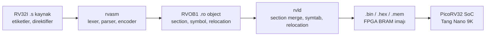
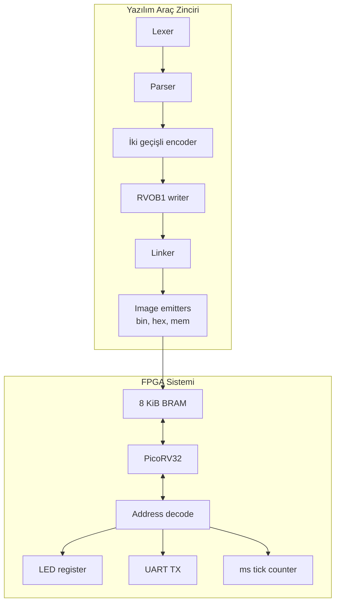
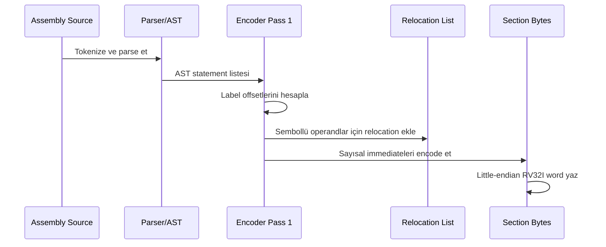
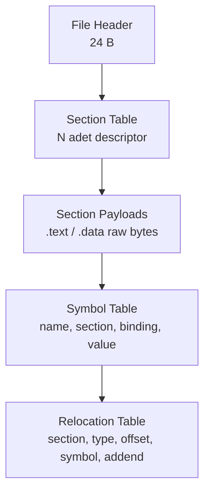
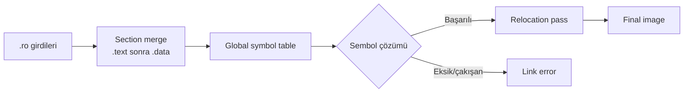
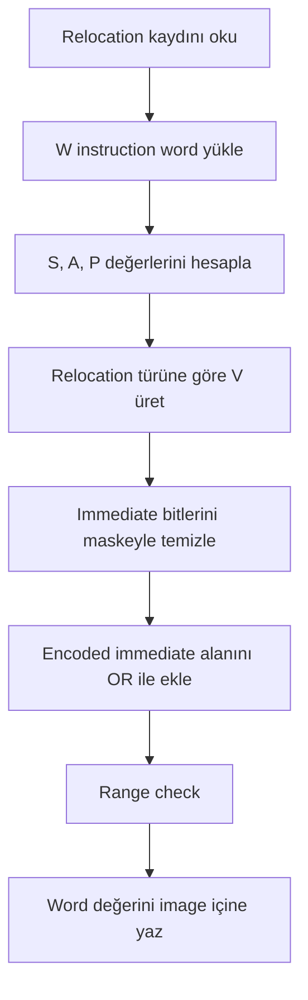
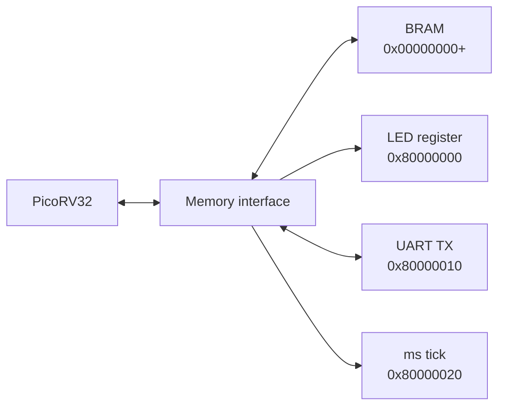
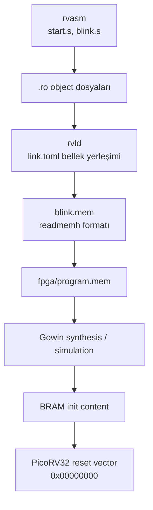

# RV32I Assembler ve Linker Tasarımı ile PicoRV32 FPGA Üzerinde Çalıştırılması

## 1. Özet

Bu projede RV32I komut kümesi için eğitim amaçlı bir assembler, RVOB1 adlı sade bir relocatable object formatı ve bu formatı düz bellek imajına dönüştüren bir linker tasarlanmıştır. Üretilen program imajı Intel HEX ve `$readmemh` uyumlu `.mem` çıktılarıyla PicoRV32 tabanlı FPGA sisteminde çalıştırılabilir hale getirilmiştir.

Çalışmanın temel katkısı, klasik derleyici araç zincirindeki assembler, object dosyası, symbol resolution, relocation ve image generation adımlarını yalın fakat gerçekçi bir mühendislik modeliyle göstermesidir. Özellikle relocation sistemi, RV32I immediate alanlarının parçalı bit yerleşimlerini dikkate alarak teknik doğruluğu korur. (PÇ1), (PÇ6), (PÇ7)

## 2. Giriş

RISC-V, açık ve modüler komut kümesi mimarisi sayesinde bilgisayar mimarisi, gömülü sistemler ve FPGA tabanlı işlemci tasarımı eğitiminde yaygın olarak kullanılmaktadır. Ancak bir işlemcinin çalıştırılması yalnızca RTL çekirdeğiyle sınırlı değildir; kaynak kodun makine koduna çevrilmesi, sembollerin çözülmesi ve hedef belleğe uygun imajın üretilmesi gerekir.

Bu proje, RV32I assembly kaynak dosyalarını PicoRV32 üzerinde çalışabilecek forma dönüştüren uçtan uca bir araç zinciri sunar:



Proje, donanım-yazılım birlikte tasarımının temel aşamalarını görünür kıldığı için mühendislik eğitimi açısından değerlidir. (PÇ8), (PÇ9)

## 3. Literatür Araştırması

RISC-V ISA, sabit 32 bit temel komut uzunluğu ve sade encoding yapısıyla eğitim araç zincirleri için uygun bir hedeftir. RV32I tabanı; aritmetik, load/store, branch, jump ve sistem komutlarını içerir. Bununla birlikte B-type ve J-type immediate alanları ardışık bitler halinde tutulmadığından assembler ve linker tarafında dikkatli bit yerleştirme gerekir.

Geleneksel sistemlerde ELF, relocatable object dosyaları için standart formattır. ELF güçlü ve genişletilebilir olmasına rağmen section header, program header, string table ve debug metadata gibi birçok yapı içerir. Bu projede eğitim amaçlı olarak RVOB1 formatı tercih edilmiştir. RVOB1, ELF'in temel fikirlerini korur: section, symbol table ve relocation table. Ancak yapı daha kısa, incelenebilir ve hex editor ile takip edilebilir durumdadır. (PÇ6)

FPGA tarafında PicoRV32, küçük alan kaplayan ve açık kaynaklı bir RV32I çekirdeğidir. Bu çekirdeğin basit bellek arabirimi, BRAM ve memory-mapped I/O tasarımını kolaylaştırır. Böylece yazılım araç zinciri çıktısı doğrudan donanım üzerinde doğrulanabilir. (PÇ10), (PÇ12)

| Alan | Kullanılan yaklaşım | Projedeki rol |
|---|---|---|
| ISA | RISC-V RV32I | Komut encoding ve çalışma semantiği |
| Object format | RVOB1 | Relocatable ara temsil |
| Linkleme | Symbol resolution + relocation | Çok dosyalı program oluşturma |
| İşlemci | PicoRV32 | FPGA üzerinde yürütme |
| Bellek başlatma | `$readmemh` `.mem` dosyası | BRAM içine program yükleme |

## 4. Sistem Mimarisi

Sistem üç ana katmandan oluşur: assembler, linker ve FPGA çalışma zamanı. Assembler kaynak kodu RVOB1 object dosyasına çevirir. Linker bir veya daha fazla object dosyasını bellek yerleşimine göre birleştirir, relocation kayıtlarını uygular ve nihai imaj üretir. FPGA tarafında PicoRV32, reset sonrasında `0x00000000` adresinden komut fetch ederek BRAM içindeki programı yürütür.



| Bileşen | Sorumluluk | Çıktı |
|---|---|---|
| Lexer | Assembly metnini token dizisine çevirir | `IDENT`, `NUMBER`, `DIRECTIVE` |
| Parser | Satır tabanlı AST üretir | Label, directive, instruction |
| Encoder | Section byte'ları ve relocation üretir | `Module` |
| Object writer | Module verisini RVOB1 formatına yazar | `.ro` |
| Linker | Section birleştirme ve relocation uygular | `Image` |
| Image emitter | Hedefe uygun çıktı üretir | `.bin`, `.hex`, `.mem` |

Bu ayrım, sistemin test edilebilir ve genişletilebilir olmasını sağlar. (PÇ1), (PÇ7), (PÇ13)

## 5. Assembler Tasarımı

Assembler, elle yazılmış bir lexer ve satır tabanlı recursive-descent parser ile başlar. Yorumlar `#` veya `;` karakterinden satır sonuna kadar kabul edilir. Register isimleri hem `x5` gibi sayısal biçimde hem de `t0`, `s1`, `ra` gibi ABI adlarıyla yazılabilir; parser sonrasında bunlar sayısal register kimliklerine normalize edilir.

Encoder iki geçişli çalışır:



Birinci geçişte `.text` ve `.data` section offsetleri belirlenir, label sembolleri kaydedilir ve sembol referansı içeren operandlar için relocation kayıtları oluşturulur. İkinci geçişte sayısal immediate değerleri doğrudan makine koduna yerleştirilir. Sembol içeren ifadelerde, sembol yerel olsa bile relocation üretilir; çünkü nihai section adresleri linker tarafından belirlenecektir.

| Komut formatı | Kritik alan | Assembler görevi |
|---|---|---|
| R-type | `funct7`, `rs2`, `rs1`, `funct3`, `rd`, `opcode` | Register alanlarını sabit konumlara yerleştirme |
| I-type | `imm[11:0]` | Sign-extended immediate encode etme |
| S-type | `imm[11:5]`, `imm[4:0]` | Store immediate alanını bölme |
| B-type | `imm[12,10:5,4:1,11]` | Branch offsetini parçalı bitlere dağıtma |
| U-type | `imm[31:12]` | Üst 20 biti yerleştirme |
| J-type | `imm[20,10:1,11,19:12]` | Jump offsetini parçalı bitlere dağıtma |

Pseudo-instruction desteği, örneğin `li`, `mv`, `j`, `call` ve `la` gibi kullanımlarla assembly yazımını pratikleştirir. Bu pseudo-instruction'lar gerçek RV32I komut dizilerine genişletilerek aynı relocation altyapısına bağlanır. (PÇ6), (PÇ7)

## 6. RVOB1 Object Formatı

RVOB1, little-endian bir relocatable object formatıdır. Dosya başlığı 24 bayttır ve ardından section descriptor alanları, section payload'ları, symbol table ve relocation table gelir. Formatın amacı, object dosyasının eğitim ortamında kolay okunması ve linker davranışının açık biçimde izlenmesidir.



| Alan | Boyut | Açıklama |
|---|---:|---|
| Magic | 4 B | `"RVOB"` |
| Version | 2 B | Format sürümü, `1` |
| Flags | 2 B | Ayrılmış alan |
| Section sayısı | 4 B | Dosyadaki section adedi |
| Symbol sayısı | 4 B | Symbol table girdi sayısı |
| Relocation sayısı | 4 B | Relocation table girdi sayısı |
| Section offset | 4 B | v1 için `24` |

Section descriptor, section adını, flag alanlarını, payload boyutunu ve payload dosya offsetini taşır. Symbol entry içinde `section_idx`, `binding` ve `value` tutulur. Buradaki `value` mutlak adres değil, section-relative offsettir. Bu karar relocatable dosya mantığı açısından önemlidir; mutlak adresi sadece linker bilir.

Relocation entry 14 bayttır:

| Alan | Boyut | İşlev |
|---|---:|---|
| `section_idx` | 1 B | Patch uygulanacak section |
| `reloc_type` | 1 B | Relocation türü |
| `offset` | 4 B | Section içi patch offseti |
| `sym_idx` | 4 B | Symbol table indeksi |
| `addend` | 4 B | Sembole eklenecek işaretli sabit |

RVOB1'de ayrı string table kullanılmaz; isimler doğrudan ilgili kayıtlara yazılır. Bu tercih dosyayı küçük projeler için okunabilir kılar ve object formatın pedagojik değerini artırır. (PÇ1), (PÇ13)

## 7. Linker ve Relocation Sistemi

Linker, object dosyalarını yükler, section'ları birleştirir, global symbol table oluşturur ve relocation kayıtlarını nihai adreslere göre uygular. Bu aşama, çok dosyalı programların tek bir adres uzayında doğru çalışmasını sağlar.



Section merge sırasında her input section için bir `linkOffset` hesaplanır. Böylece modül içindeki section-relative semboller global adreslere çevrilebilir. Local semboller yalnızca kendi modülleri içinde görünür kalır. Global semboller ortak tabloya girer; duplicate global sembol hata kabul edilir. Extern semboller bu tablo üzerinden çözülür, çözülemeyen semboller link hatası üretir. (PÇ7)

Relocation hesabında dört temel büyüklük kullanılır:

| Sembol | Anlam |
|---|---|
| `S` | Referans verilen sembolün nihai mutlak adresi |
| `A` | Addend değeri |
| `P` | Patch uygulanacak instruction adresi |
| `W` | Patch öncesi 32 bit instruction word |

Genel işlem şu şekildedir:



Patch işlemi instruction word'ü tamamen ezmez; opcode ve register alanları assembler tarafından önceden yazıldığı için immediate bitleri maskelenir ve yeni değer OR edilir. Bu yaklaşım RV32I encoding yapısıyla uyumludur.

| Relocation | Kullanım örneği | Hesap | Patch alanı |
|---|---|---|---|
| `R_RV32_32` | `.word symbol` | `S + A` | 32 bit veri |
| `R_RV32_BRANCH` | `beq x1,x2,target` | `S + A - P` | B-type immediate |
| `R_RV32_JAL` | `jal x1,target` | `S + A - P` | J-type immediate |
| `R_RV32_HI20` | `lui rd,%hi(sym)` | HI20 split | U-type üst 20 bit |
| `R_RV32_LO12_I` | `addi rd,rd,%lo(sym)` | LO12 split | I-type immediate |
| `R_RV32_LO12_S` | `sw rs,%lo(sym)(rd)` | LO12 split | S-type immediate |
| `R_RV32_PCREL_HI20` | `auipc rd,%pcrel_hi(sym)` | `S - P_auipc` | PC-relative HI20 |
| `R_RV32_PCREL_LO12_I` | `addi/lw + %pcrel_lo` | Eşleşen AUIPC split'i | PC-relative LO12 |

HI20/LO12 çiftinde önemli nokta, LO12 alanının `addi` tarafından sign-extend edilmesidir. Eğer LO12'nin 11. biti set ise HI20 değeri bir artırılarak carry etkisi telafi edilir. Örneğin `0x10000FFF` adresi için LO12 değeri sign-extend edildiğinde `-1` olur; bu nedenle HI20 `0x10001` seçilir ve toplam tekrar doğru adrese ulaşır.

PC-relative relocation için `auipc` ve onu izleyen `addi` birlikte değerlendirilir. LO12 değeri `addi` instruction adresine göre yeniden hesaplanmaz; eşleşen `auipc` adresine göre yapılan split kullanılır. Bu davranış GNU assembler yaklaşımıyla uyumludur ve `la` / `call` gibi pseudo-instruction'ların doğru çalışmasını sağlar.

Range check relocation sisteminin güvenlik mekanizmasıdır. Branch için ±4096 bayt, JAL için ±1 MiB, LO12 için ±2048 aralığı kontrol edilir. Taşma durumunda sessiz kırpma yapılmaz; linker hard error üretir. Bu karar, gömülü sistemlerde hatalı program imajı üretme riskini azaltır. (PÇ8), (PÇ9)

## 8. FPGA Entegrasyonu

FPGA sistemi PicoRV32 çekirdeği, 8 KiB BRAM, LED register, UART TX register ve serbest çalışan ms tick counter bileşenlerinden oluşur. PicoRV32 resetten çıktıktan sonra `0x00000000` adresinden fetch yapar. Bu nedenle linker script içinde `.text` section'ının ROM başlangıcı olan `0x00000000` adresine yerleştirilmesi gerekir.



| Adres | Genişlik | Yön | İşlev |
|---|---:|---|---|
| `0x00000000+` | 32 bit | R/W | 8 KiB BRAM, instruction ve data |
| `0x80000000` | 32 bit | W | LED register, düşük 6 bit LED'leri sürer |
| `0x80000010` | 32 bit | W/R | UART TX data, okuma `busy=bit0` döndürür |
| `0x80000020` | 32 bit | R | Serbest çalışan ms tick counter |

BRAM başlatma süreci `.mem` dosyasına dayanır. Linker, final image için `$readmemh` uyumlu çıktı üretir; her satırda `0x` öneki olmadan 8 hex digitlik bir 32 bit word bulunur. Verilog tarafında BRAM modülü şu mekanizmayı kullanır:

```verilog
initial $readmemh(INIT_FILE, mem);
```

Gowin sentezleyicisi ve `iverilog` simülasyonu `$readmemh` çağrısını elaboration aşamasında değerlendirir. Bu nedenle `program.mem` dosyası sentezlenen top module ile aynı dizinde bulunmalı veya mutlak dosya yolu verilmelidir. Dosya doğru yüklendiğinde BRAM başlangıç içeriği FPGA bitstream içine gömülür.



Donanım doğrulamada LED blink örneği, UART örneği ve memory-mapped I/O erişimleri sistemin uçtan uca çalıştığını gösterir. (PÇ10), (PÇ12), (PÇ17)

## 9. Testler ve Sonuçlar

Test stratejisi birim testler ve entegrasyon testleri üzerine kuruludur. Entegrasyon testleri lexer, parser, encoder, RVOB1 write/read, linker ve relocation adımlarını aynı akış içinde çalıştırır. Bu yöntem, CLI araçlarının izlediği gerçek veri yoluna yakındır.

| Test | Amaç | Beklenen sonuç |
|---|---|---|
| End-to-end blink | `_start`, `main`, `delay` sembollerini linklemek | `_start=0`, `.mem` satırları 8 hex digit |
| Forward/backward branch | Pozitif ve negatif PC-relative branch/jump | Doğru B/J immediate encoding |
| Branch overflow | Branch mesafesi alan dışına taşınca hata | Relocation error |
| Duplicate label | Aynı dosyada tekrar eden label | Encoder hatası |
| Undefined extern | Çözülemeyen harici sembol | Linker hatası |
| Data absolute reference | `.word entry` relocation | Mutlak adresin data içine yazılması |
| `la` pseudo correctness | AUIPC + ADDI PC-relative adres yükleme | Hesaplanan adres `.data` tabanı ile aynı |

Bu testler, hem normal çalışma yolunu hem de hata senaryolarını kapsar. Özellikle relocation overflow ve undefined symbol testleri, linker'ın yanlış imaj üretmek yerine açık hata verdiğini doğrular. (PÇ8), (PÇ9)

## 10. Karşılaşılan Problemler

En kritik problem, RV32I immediate alanlarının instruction word içinde ardışık olmamasıdır. B-type ve J-type komutlarda immediate bitleri farklı alanlara dağıldığı için relocation patch işlemi basit bir bit kaydırma problemi değildir. Çözüm olarak her immediate biçimi için ayrı relocation türü tanımlanmış ve patch fonksiyonları tür bazında sade tutulmuştur.

İkinci problem HI20/LO12 carry davranışıdır. LO12 alanı sign-extend edildiğinden, bit 11 set olduğunda HI20 alanının yuvarlanması gerekir. Aksi halde `lui/addi` veya `auipc/addi` çiftleri hedef adresi bir sayfa düşük hesaplayabilir.

Üçüncü problem FPGA yükleme sürecinde dosya konumudur. `$readmemh` elaboration aşamasında çalıştığı için `program.mem` dosyasının sentez dizininde bulunmaması BRAM'in beklenen programla başlamamasına yol açar. Bu nedenle build akışında `.mem` çıktısının FPGA kaynakları yanına kopyalanması açık bir adım olarak belirtilmiştir.

| Problem | Etki | Çözüm |
|---|---|---|
| Parçalı immediate encoding | Hatalı branch/jump hedefleri | Tür bazlı relocation patch |
| HI20/LO12 sign carry | Yanlış adres yükleme | LO12 bit 11'e göre HI20 yuvarlama |
| Undefined extern | Çalışma zamanı hatası riski | Link aşamasında hard error |
| Branch overflow | Sessiz adres kırpma riski | Range check ve hata üretimi |
| `.mem` dosya konumu | FPGA'da boş/yanlış program | `program.mem` dosyasını top module yanına koyma |

## 11. Etik ve Sürdürülebilirlik

Proje açık komut kümesi ve açık kaynaklı PicoRV32 çekirdeği üzerine kuruludur. Bu durum erişilebilirlik, yeniden üretilebilirlik ve eğitimde şeffaflık açısından olumludur. Object formatın sade tasarlanması, öğrencilerin araç zincirini yalnızca kullanmasını değil, denetlemesini de mümkün kılar. (PÇ12), (PÇ13)

Sürdürülebilirlik açısından RV32I tabanlı küçük bir soft-core işlemci, düşük kaynak tüketimli FPGA tasarımları için uygundur. BRAM tabanlı program yükleme, harici bellek gereksinimini azaltır. Bununla birlikte donanım programlama ve FPGA kart kullanımı sırasında enerji tüketimi, ekipman ömrü ve elektronik atık yönetimi dikkate alınmalıdır. (PÇ17)

Etik açıdan en önemli ilke, üretilen araçların hata durumlarını gizlememesidir. Undefined symbol, duplicate symbol ve relocation overflow gibi durumların açık hata üretmesi, güvenilir mühendislik uygulamasının bir parçasıdır. (PÇ8), (PÇ9)

## 12. Sonuç

Bu projede RV32I assembly kaynaklarını FPGA üzerinde çalıştırılabilir makine imajına dönüştüren uçtan uca bir araç zinciri geliştirilmiştir. Assembler, kaynak kodu RVOB1 relocatable object dosyasına çevirir; linker section birleştirme, sembol çözümü ve relocation işlemleriyle nihai imajı üretir; FPGA entegrasyonu ise bu imajı PicoRV32 BRAM'ine yükleyerek gerçek donanım yürütmesine taşır.

Relocation sistemi, projenin teknik merkezidir. B/J-type immediate parçalama, HI20/LO12 carry düzeltmesi, PC-relative AUIPC/ADDI eşleştirmesi ve range check mekanizmaları sayesinde araç zinciri yalnızca örnek programları değil, gerçekçi çok dosyalı assembly programlarını da doğru biçimde işler.

Sonuç olarak çalışma; bilgisayar mimarisi, sistem programlama ve FPGA tabanlı gömülü sistem geliştirme alanlarını tek bir mühendislik problemi altında birleştirmiştir. (PÇ1), (PÇ6), (PÇ7), (PÇ10)

## 13. Kaynakça

1. RISC-V International, *The RISC-V Instruction Set Manual, Volume I: Unprivileged ISA*.
2. RISC-V International, *RISC-V ELF psABI Specification*.
3. Clifford Wolf, *PicoRV32 - A Size-Optimized RISC-V CPU*, YosysHQ GitHub Repository.
4. Gowin Semiconductor, *Gowin FPGA Design Flow and Synthesis Documentation*.
5. System V ABI, *Executable and Linkable Format (ELF) Specification*.
6. Proje dokümantasyonu, `docs/architecture.md`.
7. Proje dokümantasyonu, `docs/object-format.md`.
8. Proje dokümantasyonu, `docs/relocation.md`.
9. Proje dokümantasyonu, `docs/encoding.md`.
10. Proje dokümantasyonu, `docs/fpga.md`.
